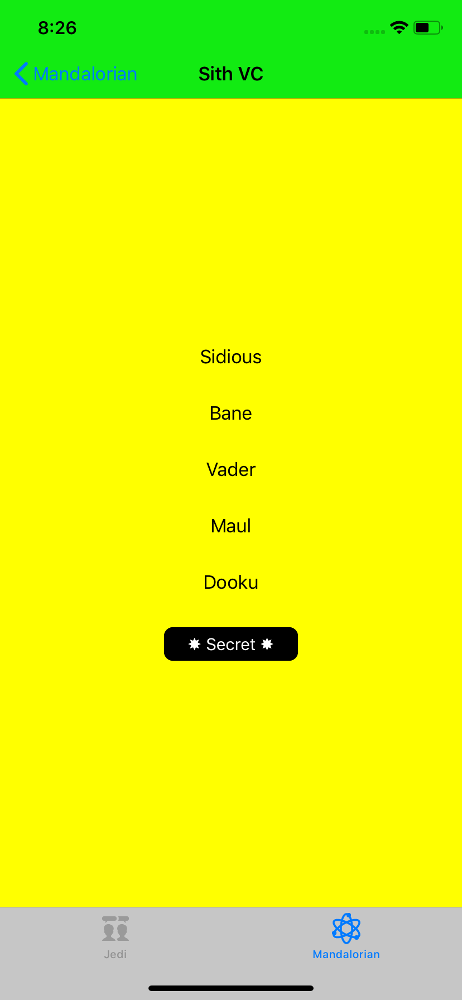
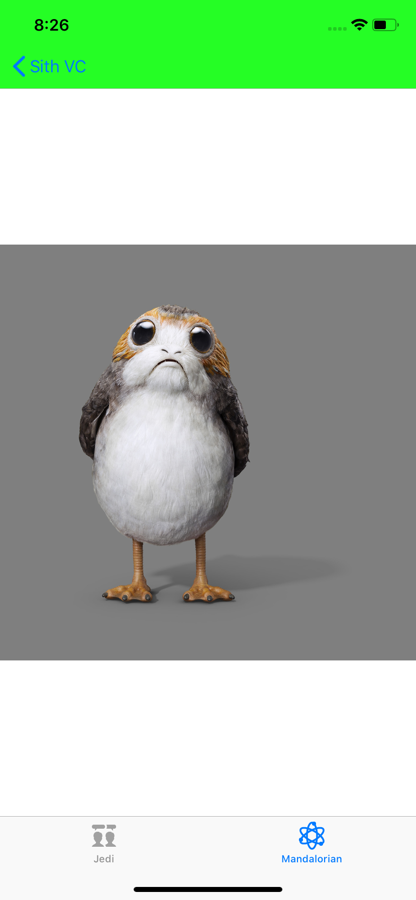

# Tiny Swizzle
### Swizzling
Apple designed Objective-C to:
> “defers as many decisions as it can from compile time and link time to runtime. Whenever possible, it does things dynamically.“

Read the full Apple [article](https://developer.apple.com/library/archive/documentation/Cocoa/Conceptual/ObjCRuntimeGuide/Introduction/Introduction.html#//apple_ref/doc/uid/TP40008048-CH1-SW1). This repo was written using `runtime` Apple APIs to swap in custom code into a normal, jailed iOS device.  The code used a technique called `Method Swizzling`.  https://nshipster.com/method-swizzling/ is an excellent article on this topic.

### Background
Originally this repo generated a `TinySwizzle.framework` to find _Dormant_ `Swift` or `ObjC` iOS code.  But I ended up reusing the repo to make customized Swizzles for the following Classes:

Class|Method|Reason  
--|--|---
NSHTTPCookie|initWithProperties:|Easy way to read all properties set on a cookie (no WKWebView yet).
NSURL| initWithString:|Simple to observe all URLs being invoked, early in the start of a journey.
UITabBarController|viewWillAppear:|Created a Tar Bar button that invoked a Dormant ViewController.
N/A|objc_copyClassList|Class dump required to find name of classes to Swizzle.
UIViewController|viewDidAppear:|Loaded _dormant_ Storyboard, XIB file or 100% coded ViewControllers. Added a UIBarButton to navigationController to access the ViewController.
UIApplication|application:continueUserActivity:restorationHandler:|Written to troubleshoot whether to to load third party code inside / outside the app.
URLSession|URLSession:didReceiveChallenge:completionHandler:|Bypass Cert Pinning code when loaded with URLSession.  
WKWebView|webView:didReceiveAuthenticationChallenge:completionHandler:|Bypass Cert Pinning code when loading a Web Journey.
WKNavigationDelegate|setNavigationDelegate:|Attach a custom Delegate to a Web Journey. Ignores the original WKNavigationDelegate.

### Understand Swizzling
#### Find Method
To swizzle successfully, you need the correct `Selector` name.  The colons are important with `ObjC`.  Get these Method signatures from `Xcode Developer Documentation`.

```
@selector(webView:didReceiveAuthenticationChallenge:completionHandler:);        // WKWebView Auth Challenge
@selector(URLSession:didReceiveChallenge:completionHandler:);                   // NSURLSession Auth Challenge
@selector(initWithProperties:);                                                 // NSHTTPCookie
```

#### Find Property
You could `Method Swizzle` on  `Objective-C Properties`.  Properties had a `getter` and `setter`.  Internal calls and properties are not shared in `Developer Documents` but you can `trace` or use a `debugger` to find the method names.

For example, I found the `WKWebView Class` had a `set Navigation Delegate` method.  Each WebView had a `Property` getter called `WKWebView.setNavigationDelegate`.  Using `Delegates` was a common iOS programming pattern.  The delegates made life easier by offerings lots of pre-canned methods.  

Find the `property` took analysis. Here is an example with a debugger:
```
 (lldb) lookup setNavigationDe
 ****************************************************
 2 hits in: WebKit
 ****************************************************
 -[WKWebView setNavigationDelegate:]
 WebKit::NavigationState::setNavigationDelegate(id<WKNavigationDelegate>)

 (lldb) b -[WKWebView setNavigationDelegate:]

 // breakpoint fires

 (lldb) po $arg1
 <WKWebView: 0x7f8e90875400; frame = (0 0; 0 0); layer = <CALayer: 0x600000fdfb20>>

 (lldb) p (char *) $arg2
 (char *) $13 = 0x00007fff51f655b3 "setNavigationDelegate:"

 (lldb) po $arg3
 <tinyDormant.YDWKViewController: 0x7f8e8f416350>
*/
```
know - without consulting documentation - I have the signature for the property's set method and I know what is passed into the method.
```
@selector(setNavigationDelegate:);
```
#### Explaining the code
The Swizzle used the Objective-C `runtime.h` APIs from Apple.  Namely:

- [x]  class_addMethod
- [x]  class_replaceMethod
- [x]  method_exchangeImplementations
- [x]  objc_getClass

Due to `Subclassing`, if you followed the StackOverflow recommendations [ and solely used `method_exchangeImplementations` ] you would create unexpected behaviour.  Take the `addFakeUIBarButton` example.  You could place the fake UIBarButtons with the `method_exchangeImplementations` without using `class_addMethod` and `class_replaceMethod`.  But the fake `viewDidLoad` got called on lots of other classes when you only targeted the  `UIViewController` class.

You will see the Swizzle code inherited from `NSObject`.  If you didn't, you would often see:
```
🍭Stopped swizzle. Class: WKWebView, originalMethod:  0x10318bef0 swizzledMethod: 0x0
```
I could fix this, in some future commit.
### Launch Dormant Code
#### Find your Class
If you wanted to target a piece of `dormant` code, you first needed to know the `Class` name.  Tick the `Target Membership` box to include the  `dumpClasses.m` file inside of the iOS app's `Target`.  Then it will run the app and print the found classes.
```
[*] 🌠 Started Class introspection...
    [*]tinyDormant.AppDelegate
    [*]tinyDormant.PorgViewController
    [*]tinyDormant.YDJediVC
    [*]tinyDormant.YDSithVC
    [*]tinyDormant.YDMandalorianVC
    [*]tinyDormant.YDPorgImageView
```
The above log was from a Swift app. Notice the `Module name`. This was an important, subtle difference between a `Swift` class and an `Objective-C` class.

If you wanted to invoke `dormant ViewControllers`, you needed to find the View Controller. It was even better if you knew whether it was:

1. A storyboard file (or a single Main.storyboard)
2. A `XIB` file
3. 100% code-only

#### Write Class Name to PList
Clone the repo.  Create a `YDSwizzlePlist.plist` file.  Check the `Target Membership` tickbox.  This must be ticked so the plist file ships inside the framework. An example plist:
```
<plist version="1.0">
    <array>
        <dict>
            <key>storyboardClassName</key>
            <string>tinyDormant.YDChewyVC</string>
            <key>storyboardID</key>
            <string>chewyStoryboardID</string>
            <key>storyboardFile</key>
            <string>Main</string>
        </dict>
    </array>
</plist>
```

Then, select the "Target Membership" the Swizzle you want. I normally used the `UIViewController` when it was embedded inside a `navigationController`.  This would add a button that would invoke the dormant code.

#### Run (Simulator)
 The project contained two `Targets`.  An iOS app and a simple framework.  The app just demonstrated what the Swizzle framework could do.  This app worked with a Simulator or real device.

#### Run (device with real app)
The framework could be repackaged inside a real iOS app.
>  **PLEASE USE IT FOR GOOD**.  

The process was summarised as :
```
- Unzipping the IPA
- Adding the Swizzle framework
- Adding a load command, so the app knew to load the new framework
- Zipping the app contents
- Code signing the modified IPA
```
The commands were as follows:
```
optool install -c load -p "@executable_path/Frameworks/tinySwizzle.framework/tinySwizzle" -t Payload/MyApp.app/MyApp
jtool -arch arm64 -l Payload/MyApp.app/MyApp
7z a unsigned.ipa Payload
applesign -7 -i < DEV CODE SIGNING ID > -m embedded.mobileprovision unsigned.ipa -o ready.ipa
```

### Results
The `Sith` ViewController was 100% code generated. The dynamic nature of Objective-C let you create a class at `runtime`:
```
Class SithClass = objc_getClass(dormantClassStr);
id sithvc = class_createInstance(SithClass, 0);
```
After you select the `FakeUIBarButtonItem` it loaded the `ViewController`.



But to invoke the `PorgViewController` you need to find the `ViewController and` the `XIB` file.  Then you can run this line:
```
let porgvc = YDPorgVC(nibName: "PorgViewController", bundle: nil)
```
Notice how you use the ViewController (`YDPorgVC`) to cast the XIB file.  After that, you can choose what option you want to show the code.
```
self.navigationController?.pushViewController(porgvc, animated: true)
```



### What next?
This worked on Objective-C and Swift code.  

- A Swizzle helper for Class Methods. At the moment it just swizzles Instance Methods.
- A different API for swizzling: https://blog.newrelic.com/engineering/right-way-to-swizzle/
- I only tried with Swift code that inherits from `NSObject`.
- Try the technique on `SwiftUI`.
